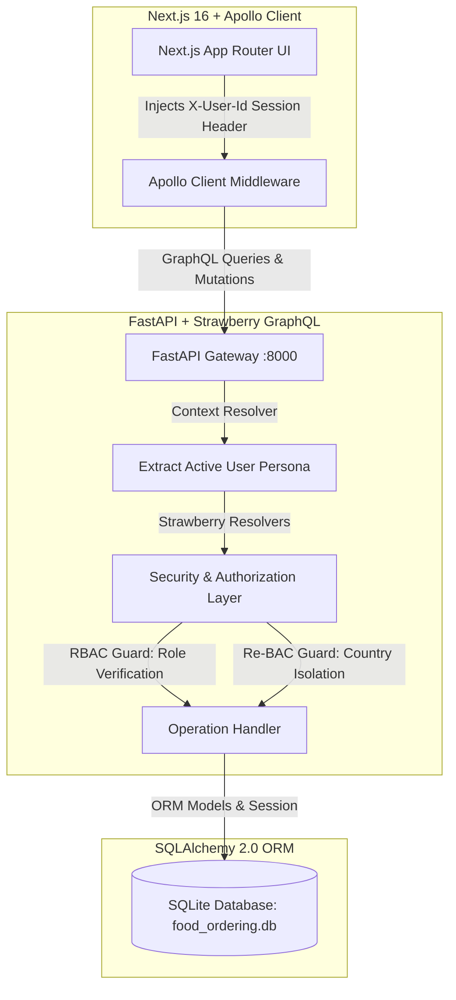
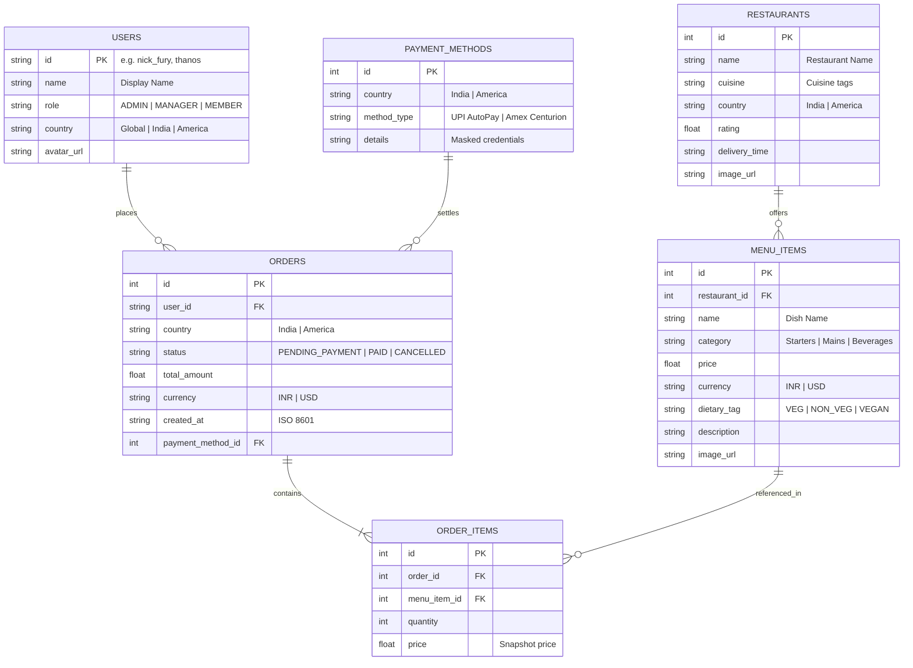

# System Architecture, Design Decisions & GraphQL API Collection

This document outlines the technical architecture, data models, access control guarantees (RBAC + Re-BAC), and the complete GraphQL API query collection for the Slooze Role-Based Food Ordering Platform.

---

## 🏗️ 1. High-Level System Architecture

The application is structured as a decoupled full-stack architecture with clear separation of concerns between client, API gateway, authorization guards, and the database persistence layer:



### Key Architectural Layers:
1. **Frontend Presentation**: Next.js 16 with React 19 and Tailwind CSS. State is managed via Apollo Client cache. A custom middleware link attaches the active persona ID into the `X-User-Id` HTTP header.
2. **Context Resolution**: FastAPI extracts the incoming `X-User-Id` header and resolves the authenticated `User` record into the GraphQL execution context for every request.
3. **Authorization Layer (`backend/app/core/security.py`)**:
   - **Role-Based Access Control (RBAC)**: Validates if the user's role (`ADMIN`, `MANAGER`, `MEMBER`) allows executing a specific operation (e.g. checkout, cancel, update payment).
   - **Relational Access Control (Re-BAC)**: Validates whether the targeted resource belongs to the user's assigned country (`India`, `America`), isolating regional data silos.
4. **Data Persistence**: SQLite database accessed via SQLAlchemy 2.0 ORM with relational cascades and indexes.

---

## 🗄️ 2. Database Schema & Data Models

The database schema is defined using SQLAlchemy in `backend/app/models/schema.py`:



---

## 👥 3. Seeded Personas & Regional Catalog

### Predefined Employee Personas & Login Credentials:
| Persona ID | Full Name | Assigned Role | Regional Scope | Unique Login Password | Access Capabilities |
| :--- | :--- | :--- | :--- | :--- | :--- |
| `nick_fury` | Nick Fury | **ADMIN** | **Global** | `Fury@Admin99` | Full org-wide access, pay/cancel any order, configure payment channels, view analytics |
| `captain_marvel`| Captain Marvel | **MANAGER** | **India** | `Marvel@India77` | Browse India menu, create India orders, approve/pay & cancel India orders |
| `captain_america`| Captain America | **MANAGER** | **America** | `Cap@America88` | Browse US menu, create US orders, approve/pay & cancel US orders |
| `thanos` | Thanos | **MEMBER** | **India** | `Thanos@India01` | Browse India menu, create India orders (status: `PENDING_PAYMENT`) |
| `thor` | Thor | **MEMBER** | **India** | `Thor@India02` | Browse India menu, create India orders (status: `PENDING_PAYMENT`) |
| `travis` | Travis | **MEMBER** | **America** | `Travis@America03` | Browse US menu, create US orders (status: `PENDING_PAYMENT`) |

### Regional Restaurants:
* **India**:
  * *The Spice Pavilion* (Awadhi & Mughlai Specialties)
  * *Dakshin Coastal Kitchen* (South Indian & Chettinad)
* **America**:
  * *Gotham Smokehouse & Grill* (Artisanal Burgers & BBQ)
  * *Liberty Slice Pizzeria* (Wood-Fired Neapolitan & Pasta)

---

## 🧬 4. GraphQL API Collection (GraphiQL Playground)

Test these queries directly inside the GraphiQL playground at [http://localhost:8000/graphql](http://localhost:8000/graphql).

> [!TIP]
> In the GraphiQL Playground, open the **Headers** tab at the bottom and supply:
> `{"X-User-Id": "thanos"}` (or `captain_marvel`, `captain_america`, `nick_fury`).

### 1. Queries

#### A. Fetch Active Profile
```graphql
query GetMyProfile {
  me {
    id
    name
    role
    country
    avatarUrl
  }
}
```

#### B. Fetch Regional Restaurants (Re-BAC Filtered)
```graphql
query GetRestaurants($search: String) {
  restaurants(search: $search) {
    id
    name
    cuisine
    country
    rating
    deliveryTime
    menuItems {
      id
      name
      category
      price
      currency
      dietaryTag
      description
    }
  }
}
```

#### C. Fetch Orders Ledger (Re-BAC Filtered)
```graphql
query GetOrders($statusFilter: String) {
  orders(statusFilter: $statusFilter) {
    id
    country
    status
    totalAmount
    currency
    createdAt
    user {
      name
      role
    }
    items {
      quantity
      price
      menuItem {
        name
        category
      }
    }
    paymentMethod {
      methodType
      details
    }
  }
}
```

#### D. Executive Analytics Dashboard (Admin Only)
* **Header**: `{"X-User-Id": "nick_fury"}`
```graphql
query GetExecutiveAnalytics {
  adminAnalytics {
    totalUsers
    totalOrders
    totalPending
    totalPaid
    totalCancelled
    regionalMetrics {
      country
      totalOrders
      totalGmv
      currency
      activeRestaurants
    }
  }
}
```

---

### 2. Mutations

#### A. Create Food Order (All Roles)
* **Header**: `{"X-User-Id": "thanos"}`
* **Variables**:
```json
{
  "country": "India",
  "items": [
    { "menuItemId": 1, "quantity": 2 },
    { "menuItemId": 4, "quantity": 1 }
  ]
}
```
* **Mutation**:
```graphql
mutation CreateNewOrder($country: String!, $items: [OrderItemInput!]!) {
  createOrder(country: $country, items: $items) {
    id
    status
    totalAmount
    currency
    country
  }
}
```

#### B. Checkout & Pay Order (Manager / Admin Only)
* **Header**: `{"X-User-Id": "captain_marvel"}` (Succeeds) / `{"X-User-Id": "thanos"}` (Fails with RBAC Forbidden)
* **Variables**:
```json
{
  "orderId": 1
}
```
* **Mutation**:
```graphql
mutation ApproveAndPayOrder($orderId: Int!) {
  payOrder(orderId: $orderId) {
    id
    status
    paymentMethod {
      methodType
      details
    }
  }
}
```

#### C. Cancel Order (Manager / Admin Only)
* **Header**: `{"X-User-Id": "captain_marvel"}`
* **Variables**:
```json
{
  "orderId": 1
}
```
* **Mutation**:
```graphql
mutation CancelExistingOrder($orderId: Int!) {
  cancelOrder(orderId: $orderId) {
    id
    status
  }
}
```

#### D. Update Corporate Payment Gateway (Admin Exclusive)
* **Header**: `{"X-User-Id": "nick_fury"}`
* **Variables**:
```json
{
  "id": 1,
  "methodType": "Corporate UPI AutoPay",
  "details": "slooze.enterprise@hdfcbank"
}
```
* **Mutation**:
```graphql
mutation UpdatePaymentChannel($id: Int!, $methodType: String!, $details: String!) {
  updatePaymentMethod(id: $id, methodType: $methodType, details: $details) {
    id
    methodType
    details
  }
}
```
